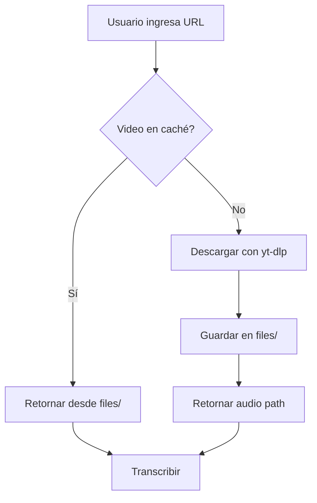

# Sistema de Caché de Videos - Milix

## ¿Cómo funciona?

Milix implementa un **sistema de caché inteligente** que guarda los archivos de audio descargados en la carpeta `files/` para evitar descargas repetidas del mismo video.

## Beneficios

✅ **Ahorro de tiempo:** Videos ya descargados se cargan instantáneamente  
✅ **Ahorro de ancho de banda:** No descargas el mismo video múltiples veces  
✅ **Desarrollo más rápido:** Prueba ejercicios sin esperar descargas  
✅ **Funciona offline:** Una vez descargado, puedes usar el video sin conexión

## Estructura

```
Milix/
├── files/                    # Caché de audios (auto-creada)
│   ├── jNQXAC9IVRw.m4a      # Archivo identificado por video ID
│   ├── dQw4w9WgXcQ.m4a      # Otro video
│   └── ...
├── transform_video.py        # Lógica de descarga y caché
└── app.py                    # UI con gestión de caché
```

## Identificación de Videos

Cada video se identifica por:
1. **Video ID de YouTube** (ej: `jNQXAC9IVRw`)
2. Si falla, usa un **hash MD5** de la URL

El archivo guardado se nombra: `{video_id}{extension}`

## Uso en el Código

```python
from transform_video import get_audio_from_youtube

# Con caché (por defecto)
audio_path = get_audio_from_youtube("https://youtube.com/watch?v=...")
# Primera vez: descarga y guarda en files/
# Segunda vez: retorna desde files/ instantáneamente

# Sin caché (forzar descarga)
audio_path = get_audio_from_youtube(url, use_cache=False)
```

## Gestión desde la UI

En la app de Streamlit, el sidebar muestra:

- **Número de audios en caché**
- **Tamaño total ocupado**
- **Lista de archivos** (primeros 10)
- **Botón "Limpiar caché"** para liberar espacio

## Limpieza Manual

```bash
# Limpiar toda la caché
rm -rf files/

# O en Windows
rmdir /s files

# La carpeta se recreará automáticamente
```

## Consideraciones

### Tamaño de Archivos
- Video corto (1-2 min): ~1-3 MB
- Video medio (5-10 min): ~5-15 MB
- Video largo (30+ min): ~30-50 MB

### Cuándo Limpiar la Caché

Limpia la caché cuando:
- Ocupes mucho espacio en disco
- Hayas probado muchos videos diferentes
- Quieras forzar re-descarga de un video específico

### Caché en Producción (Streamlit Cloud)

⚠️ **Importante:** En Streamlit Cloud, la caché es **temporal** y se reinicia:
- Al redesplegar la app
- Después de inactividad prolongada
- Si la instancia se reinicia

Para caché persistente en Cloud, considera:
- Amazon S3
- Google Cloud Storage
- Servicio de almacenamiento externo

## Flujo de Caché



## API de Caché

### Funciones Públicas

```python
# Obtener audio (con caché)
get_audio_from_youtube(url: str, work_dir: str = None, use_cache: bool = True)

# Obtener video ID
_get_video_id_from_url(url: str) -> str | None

# Verificar si está en caché
_get_cached_audio(video_id: str) -> str | None

# Guardar manualmente en caché
_save_to_cache(source_path: str, video_id: str) -> str | None
```

### Constantes

```python
CACHE_DIR  # Path("files/") - Directorio de caché
```

## Ejemplos de Uso

### Ejemplo 1: Desarrollo Local

```python
# Primera ejecución
audio = get_audio_from_youtube("https://youtube.com/watch?v=abc123")
# Descarga: ~5 segundos
# Retorna: files/abc123.m4a

# Segunda ejecución (mismo video)
audio = get_audio_from_youtube("https://youtube.com/watch?v=abc123")
# Caché hit: <0.1 segundos
# Retorna: files/abc123.m4a
```

### Ejemplo 2: Testing

```python
# Test con video conocido (en caché)
def test_transcription():
    # Video ya descargado, test es rápido
    audio = get_audio_from_youtube(TEST_VIDEO_URL)
    transcription = transcribe_audio(audio)
    assert len(transcription) > 0
```

### Ejemplo 3: Limpiar Caché Programáticamente

```python
import shutil
from transform_video import CACHE_DIR

# Limpiar toda la caché
shutil.rmtree(CACHE_DIR)
CACHE_DIR.mkdir(exist_ok=True)

# Limpiar archivos antiguos (>7 días)
import time
cutoff = time.time() - (7 * 86400)
for file in CACHE_DIR.glob("*"):
    if file.stat().st_mtime < cutoff:
        file.unlink()
```

## Troubleshooting

### "No encuentra el video en caché"

**Causa:** Video ID cambió o URL diferente  
**Solución:** Usa la misma URL exacta, o limpia caché y vuelve a descargar

### "Caché ocupa mucho espacio"

**Causa:** Muchos videos descargados  
**Solución:** Click en "Limpiar caché" en el sidebar

### "Video corrupto en caché"

**Causa:** Descarga interrumpida anteriormente  
**Solución:** Limpia caché o borra el archivo específico:
```bash
rm files/VIDEO_ID.m4a
```

## Logs y Debug

Para ver actividad de caché, activa modo verbose:

```python
import logging
logging.basicConfig(level=logging.DEBUG)

# Verás logs como:
# DEBUG: Checking cache for video: jNQXAC9IVRw
# DEBUG: Cache hit! Returning: files/jNQXAC9IVRw.m4a
```

## Contribuir

Para mejorar el sistema de caché:

1. Añadir **metadata** (fecha, tamaño, duración)
2. Implementar **TTL** (time-to-live) automático
3. Añadir **compresión** de archivos antiguos
4. Implementar **caché distribuida** para Cloud
